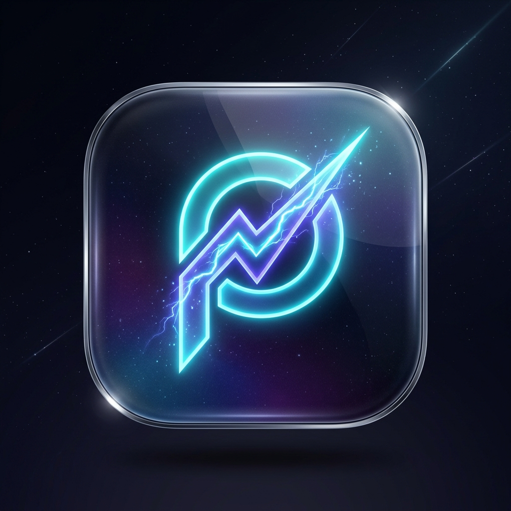
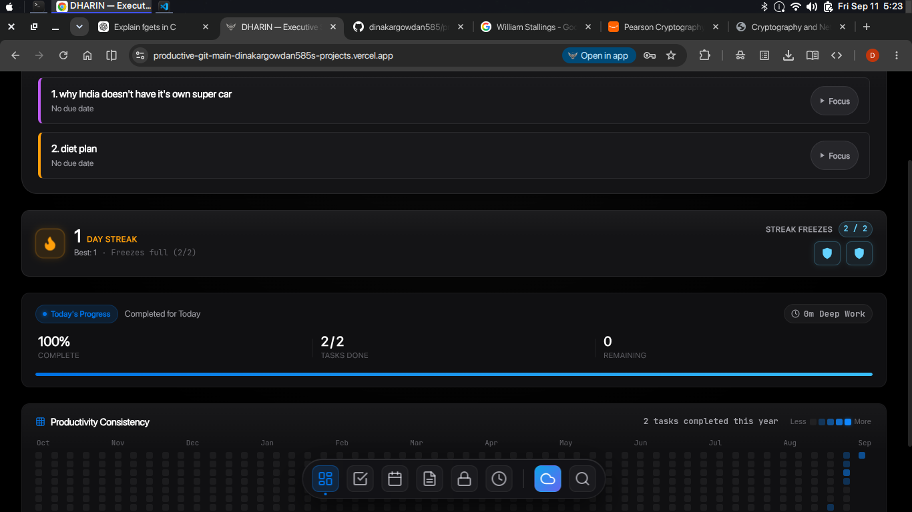

<div align="center">

  

  # DHARIN
  ### The Executive Productivity Operating System

  [](https://productive-git-main-dinakargowdan585-projects.vercel.app)
  [](https://productive-git-main-dinakargowdan585-projects.vercel.app)
  [](#-zero-knowledge-encrypted-vault)
  [](#-offline-first--cloud-sync)

  <p align="center">
    <strong>A high-performance, glassmorphic personal operating system inspired by Apple macOS & iOS design principles.</strong><br/>
    Equipped with Duolingo-style streak freeze mechanics, deep work execution, Apple StandBy ambient display, zero-knowledge encrypted vault, calendar time-blocking, and multi-device cloud synchronization.
  </p>

</div>

---

## 📸 Preview & Screenshots

<div align="center">
  
  <p><em>Executive Dashboard: Daily Focus Tasks, Duolingo-Style Streak Freeze Engine, Today's Progress, and 365-Day Productivity Consistency Heatmap.</em></p>
</div>

---

## ✨ Key Features & Capabilities

### 🔥 Duolingo-Style Streak Freeze Engine
* **Persistent Daily Streaks**: Tracks your uninterrupted daily execution with milestone celebrations.
* **Consumable Streak Freezes**: Hold up to 2 streak freezes that automatically protect your streak during missed days at midnight rollover.
* **7-Day Bonus Progression**: Earn +1 Streak Freeze for every 7 consecutive productive days.
* **Interactive Vault Modal**: View streak statistics, best historical runs, active inventory, and protected calendar dates.
* **Productivity Consistency Heatmap**: Full 365-day GitHub-style interactive task contribution matrix.

### ⏱️ Focus Planner & Deep Work Execution
* **Eisenhower Prioritization**: Organize high-impact tasks by urgency and importance with drag-and-drop sequencing.
* **Integrated Pomodoro Engine**: Deep work focus timers with ambient soundscapes and session logging.
* **Picture-in-Picture (PiP) Floating Widget**: Keep track of remaining focus intervals while navigating other sections.
* **Automated Midnight Rollover**: Seamless daily reset that preserves recurring habits and evaluates streak protection.

### 🌙 Apple StandBy Mode
* **Ambient Nightstand & Desk Display**: Fullscreen clock interface with live seconds, date, and battery indicator.
* **Red-Shift Night Mode**: Adaptive ultra-low-light monochrome red theme to prevent eye strain in dark environments.
* **Focus & Progress Rings**: Glanceable view of active focus blocks and daily completion rates.
* **Auto-Idle Dimming**: Energy-saving display transitions for OLED screens.

### 📅 Calendar & Time Blocking
* **Multi-View Scheduling**: Interactive Month, Week, and Day views with category color codes.
* **Deep Work Time Slots**: Allocate dedicated focus blocks directly on your calendar timeline.
* **Streak Protection Badges**: Visual indicator tags for frozen and protected historical days.

### 📝 Cornell Knowledge Base & Notes
* **Structured Cornell Format**: Integrated Cues, Notes, and Summary layout for high-retention learning.
* **Live Markdown Engine**: Real-time rendering with syntax highlighting, checklists, and code formatting.
* **Categorized Tagging**: Rapid organizational filters and instant full-text search.

### 🔐 Zero-Knowledge Encrypted Vault
* **Client-Side AES-GCM 256-bit Encryption**: Passwords, API tokens, and secret documents are encrypted locally before leaving your browser.
* **PBKDF2 Key Derivation**: High-iteration key stretching (100,000 rounds) ensures cryptographic resistance against brute-force attacks.
* **Inactivity Auto-Lock**: Cryptographic keys are purged from browser memory when idle to ensure strict confidentiality.

### ☁️ Offline-First & Cloud Sync
* **Local-First Architecture**: Powered by IndexedDB and LocalStorage for sub-millisecond response times without internet access.
* **Supabase Cloud Sync**: Real-time multi-device cloud synchronization with conflict resolution.
* **Google OAuth & Magic Link**: Secure passwordless authentication.

### ⌘ macOS Glassmorphic Interface & Command Palette
* **Dynamic macOS Dock**: Fluid spring physics and quick-launch navigation.
* **Universal Command Palette (`Cmd / Ctrl + K`)**: Lightning-fast cross-entity search across tasks, notes, calendar events, and settings.
* **Dark / Light Obsidian Themes**: Handcrafted typography and Apple Studio color tokens.

---

## 🛠️ Architecture & Tech Stack

```
productive/
├── index.html                  # Single Page Application entry point & modal definitions
├── css/
│   └── styles.css              # Apple Obsidian Design System, glassmorphism & responsive layouts
├── js/
│   ├── app.js                  # Application Router, Dock Controller & Command Palette
│   ├── config.js               # Global configuration & environment constants
│   ├── store.js                # State management, local storage & IndexedDB bridge
│   ├── dashboard.js            # Executive dashboard, Streak modal & Heatmap renderer
│   ├── dayRollover.js          # Duolingo-style Streak Freeze engine & midnight rollover
│   ├── planner.js              # Eisenhower Matrix task manager & Pomodoro timer
│   ├── calendar.js             # Time blocking, month/week/day views & event engine
│   ├── notes.js                # Cornell notes system & Markdown processor
│   ├── vault.js                # Zero-Knowledge AES-GCM 256-bit encrypted credential vault
│   ├── standby.js              # Apple iOS 17 StandBy fullscreen desk display
│   ├── supabase.js             # Supabase Auth, PostgreSQL cloud sync & remote backup
│   └── fx.js                   # Sound effects, celebration confetti & UI haptics
├── storage/
│   ├── database.js             # IndexedDB wrapper & schema versioning
│   ├── repositories/           # Abstract repository layer for data entities
│   └── sync/
│       └── syncEngine.js       # Bi-directional cloud sync engine with offline queuing
├── assets/                     # App icons, vectors, audio, and screenshots
└── sw.js                       # Service Worker for offline PWA caching
```

* **Frontend**: Vanilla ES6+ JavaScript, Modern CSS3 with Design Tokens, HTML5 Web Components.
* **Cryptography**: Web Crypto API (`crypto.subtle`), AES-GCM (256-bit), PBKDF2 (SHA-256).
* **Storage & Caching**: IndexedDB (`idb`), Service Worker Cache Storage, LocalStorage.
* **Cloud & Database**: [Supabase](https://supabase.com) (PostgreSQL, Row-Level Security, Auth).

---

## 🚀 Getting Started

### Prerequisites
* Any modern web browser with ES6+ and Web Crypto support (Chrome, Safari, Firefox, Edge).
* A lightweight static file server (or Python / Node.js).

### Running Locally

1. **Clone the repository:**
   ```bash
   git clone https://github.com/dinakargowdan585/productive.git
   cd productive
   ```

2. **Serve the application:**
   Using Python:
   ```bash
   python3 -m http.server 3000
   ```
   Or using Node.js:
   ```bash
   npx serve .
   ```

3. **Open in browser:**
   Navigate to `http://localhost:3000` to launch DHARIN.

---

## ⌨️ Keyboard Shortcuts

| Shortcut | Action |
| :--- | :--- |
| <kbd>Cmd</kbd> / <kbd>Ctrl</kbd> + <kbd>K</kbd> | Open Universal Command Palette |
| <kbd>Cmd</kbd> / <kbd>Ctrl</kbd> + <kbd>1</kbd> | Switch to **Dashboard** |
| <kbd>Cmd</kbd> / <kbd>Ctrl</kbd> + <kbd>2</kbd> | Switch to **Planner & Focus** |
| <kbd>Cmd</kbd> / <kbd>Ctrl</kbd> + <kbd>3</kbd> | Switch to **Calendar** |
| <kbd>Cmd</kbd> / <kbd>Ctrl</kbd> + <kbd>4</kbd> | Switch to **Cornell Notes** |
| <kbd>Cmd</kbd> / <kbd>Ctrl</kbd> + <kbd>5</kbd> | Switch to **Encrypted Vault** |
| <kbd>Cmd</kbd> / <kbd>Ctrl</kbd> + <kbd>6</kbd> | Switch to **Apple StandBy Mode** |
| <kbd>Esc</kbd> | Close active modal / Exit StandBy mode |

---

## 🔒 Security & Privacy

* **Zero-Knowledge Principle**: The vault encryption key is derived directly from your master passphrase inside your client browser using PBKDF2 with 100,000 iterations and AES-GCM 256-bit encryption.
* **No Plaintext Transmission**: Passphrases and unencrypted vault secrets are never sent to any server or cloud database.
* **Memory Safety**: Decrypted vault contents and keys are wiped upon locking or session timeout.

---

## 📄 License

This project is open source and available under the [MIT License](LICENSE).

---

<div align="center">
  <sub>Engineered with precision for peak human productivity. Crafted by Dinakar.</sub>
</div>